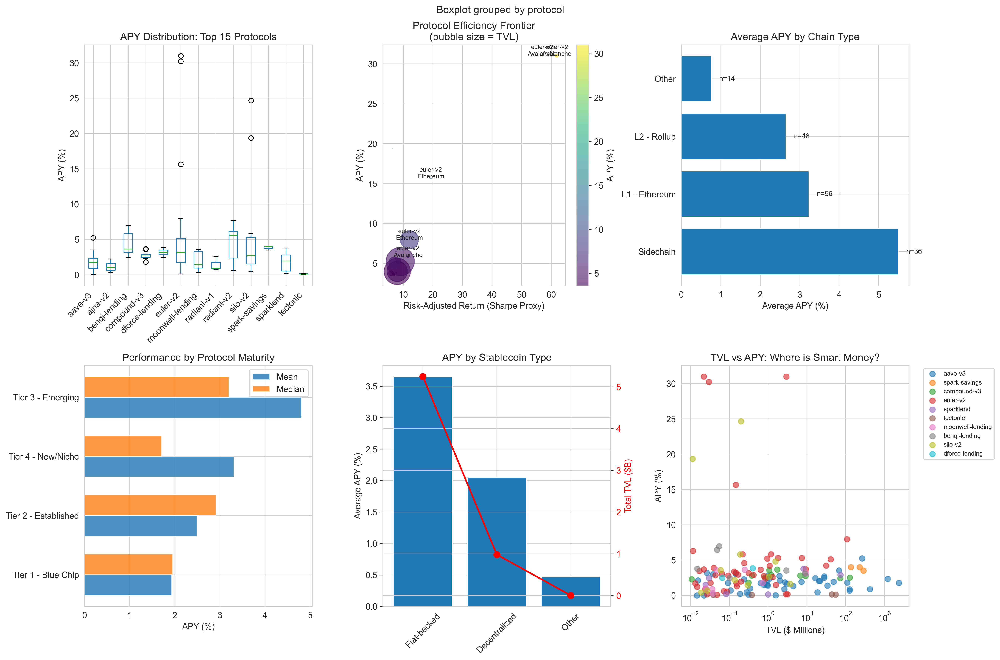

# DeFi Yield Optimization: Portfolio Theory Under Transaction Costs

**Research Question**: Can machine learning improve portfolio allocation across 
decentralized lending protocols enough to overcome transaction cost barriers for 
small depositors?

## Motivation

Decentralized lending protocols offer stablecoin yields 5-10 percentage points 
above traditional savings rates. However, blockchain transaction costs create 
barriers: gas fees of $5-50 can represent 1-10% of deposits under $1,000, 
potentially overwhelming yield advantages for small-balance users.

This repository explores whether optimized allocation strategies can make 
automated DeFi portfolio management economically viable for deposits <$500—
a threshold relevant to financial inclusion in emerging markets.

## Current Status: Data Collection & Initial Analysis

**Completed (Feb 16, 2026)**:
- ✅ Comprehensive yield data collection across 40+ protocols and 25+ chains
- ✅ Initial landscape analysis showing APY distributions and risk-adjusted returns
- ✅ Protocol categorization framework (tier, chain type, stablecoin backing)

**In Progress**:
- [ ] ML Time-series yield forecasting models (ARIMA, LSTM, XGBoost)
- [ ] Optimal rebalancing strategy under transaction costs
- [ ] Backtesting across different deposit sizes

## Preliminary Findings



*Figure 1: DeFi stablecoin yield landscape (Feb 2026). Analysis of 247 lending 
pools shows heterogeneous APY distributions across protocols, with risk-adjusted 
returns (Sharpe proxies) varying significantly by chain type and protocol maturity.*

**Key observations from initial data**:
- Market average APY: [To be updated after first collection run]
- Cross-chain yield spread: L2 rollups vs. Ethereum mainnet comparison
- Protocol efficiency: Risk-adjusted return rankings

*Full analysis in: [`analysis/01_initial_yield_exploration.ipynb`](analysis/01_initial_yield_exploration.ipynb)*

## Methodology

### Data Sources
- DeFiLlama Yields API: Real-time APY data across protocols
- Coverage: Aave V3, Compound V3, Morpho, Spark, Radiant, Venus, and 30+ others
- Metrics: APY (base + rewards), TVL, 30-day volatility

### Theoretical Framework
Extending portfolio optimization under proportional transaction costs 
(Constantinides 1986; Davis & Norman 1990) to multi-protocol DeFi context 
with discrete, non-convex transaction costs.

### Planned Models
1. **Forecasting**: ML Time-series prediction to reduce rebalancing frequency
2. **Optimization**: CVaR-constrained allocation under gas cost constraints  
3. **Backtesting**: Performance across deposit sizes ($100-$5000)

## Repository Structure
```
/DeFi-YIELD-Economics
├── /data
│ ├── /raw # Daily APY snapshots from DeFiLlama
│ └── collect_apy_data.py
├── /analysis
│ └── 01_initial_yield_exploration.ipynb
├── /results
│ └── /figures
└── README.md
```

## Replication

```bash
# Install dependencies
pip install -r requirements.txt

# Collect current market data
python data/collect_apy_data.py

# Run analysis
jupyter notebook analysis/01_initial_yield_exploration.ipynb
```

## Theoretical Context
This work relates to:
1. Transaction cost theory: Optimal portfolio rebalancing with proportional costs
2. DeFi mechanism design: Risk measurement in algorithmic lending markets
3. Financial inclusion: Access barriers in high-inflation economies

Detailed literature review to be added as analysis progresses.

## Applications
Findings will inform mechanism design for accessible DeFi wealth management
platforms. Product development considerations tracked separately.

### Status:
Early-stage research & Product development (Feb 2026).
Data infrastructure complete; rigorous forecasting models in development (first iterations & prototypes complete).
