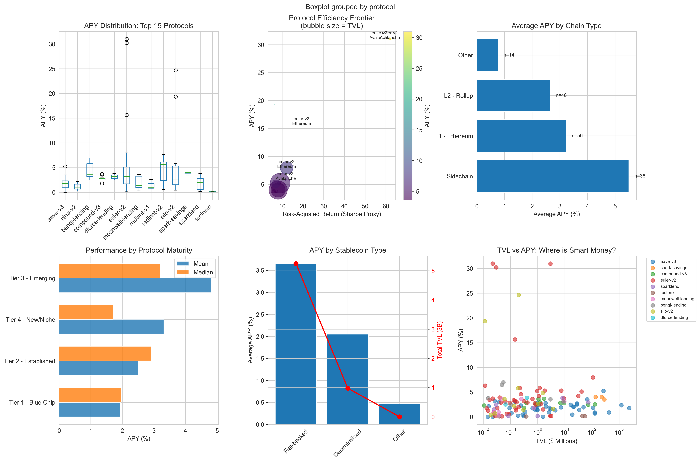

# DeFi Yield Optimization: Portfolio Theory Under Transaction Costs

**Research Question**: Can machine learning improve portfolio allocation across 
decentralized lending protocols enough to overcome transaction cost barriers for 
small depositors?

## Motivation

Decentralized lending protocols offer stablecoin yields 5-10 percentage points 
above traditional savings rates. However, blockchain transaction costs create 
barriers: gas fees of $5-50 can represent 1-10% of deposits under $1,000, 
potentially overwhelming yield advantages for small-balance users.

This repository explores whether optimized allocation strategies can make 
automated DeFi portfolio management economically viable for deposits <$500—
a threshold relevant to financial inclusion in emerging markets.

## Current Status: Full Pipeline Implemented

**Completed**:

- ✅ Comprehensive yield data collection across 40+ protocols and 25+ chains
- ✅ Initial landscape analysis showing APY distributions and risk-adjusted returns
- ✅ Protocol categorization framework (tier, chain type, stablecoin backing)
- ✅ ML yield forecasting models (ARIMA, XGBoost) — `models/yield_forecasting.py`
- ✅ Rebalancing optimization under transaction costs — `models/rebalancing_optimization.py`
- ✅ Protocol risk scoring (multi-factor) — `risk/protocol_scoring.py`
- ✅ Capital-at-Risk (CaR) analysis across deposit sizes — `risk/capital_at_risk.py`
- ✅ Liquidity coverage ratio modeling — `risk/liquidity_coverage.py`
- ✅ Risk-adjusted portfolio optimization — `risk/risk_adjusted_optimization.py`
- ✅ End-to-end pipeline orchestrator (`main.py`) — one command runs all stages
- ✅ Backtesting across deposit sizes ($100–$10,000) with L1/L2 gas comparison
- ✅ Results interpretation notebook — `analysis/02_results_interpretation.ipynb`

## Preliminary Findings



*Figure 1: DeFi stablecoin yield landscape (Feb 2026). Analysis of 247 lending 
pools shows heterogeneous APY distributions across protocols, with risk-adjusted 
returns (Sharpe proxies) varying significantly by chain type and protocol maturity.*

**Key observations from initial data**:

- Market average APY: see [`results/forecasting_performance.csv`](results/forecasting_performance.csv) for per-protocol APY means and volatility
- Cross-chain yield spread: L2 rollups vs. Ethereum mainnet comparison
- Protocol efficiency: Risk-adjusted return rankings in [`results/protocol_risk_scores.csv`](results/protocol_risk_scores.csv)
- Forecasting: ARIMA achieves up to 41% MAE improvement over naive baseline on stable protocols; performance degrades on high-volatility pools

*Full analysis in: [`analysis/01_initial_yield_exploration.ipynb`](analysis/01_initial_yield_exploration.ipynb)*

## Methodology

### Data Sources
- DeFiLlama Yields API: Real-time APY data across protocols
- Coverage: Aave V3, Compound V3, Morpho, Spark, Radiant, Venus, and 30+ others
- Metrics: APY (base + rewards), TVL, 30-day volatility

### Theoretical Framework
Extending portfolio optimization under proportional transaction costs 
(Constantinides 1986; Davis & Norman 1990) to multi-protocol DeFi context 
with discrete, non-convex transaction costs.

### Models

1. **Forecasting** — ARIMA and XGBoost time-series models to predict APY and reduce unnecessary rebalancing frequency (`models/yield_forecasting.py`)
2. **Optimization** — CVaR-constrained allocation under gas cost constraints with concentration penalties (`models/rebalancing_optimization.py`)
3. **Risk Framework** — Multi-factor protocol scoring, CaR, and liquidity coverage analysis (`risk/`)
4. **Backtesting** — Performance simulation across deposit sizes ($100–$5,000) *(in progress)*


## Repository Structure
```
/DeFi-YIELD-Economics
├── /data
│   ├── /raw                          # Daily APY snapshots from DeFiLlama
│   ├── /processed
│   │   └── yield_panel.csv           # Panel written before forecasting & backtest
│   ├── panel_latest.csv              # Latest merged panel (written by build_timeseries)
│   ├── build_timeseries.py
│   └── collect_apy_data.py
├── /analysis
│   ├── 01_initial_yield_exploration.ipynb
│   └── 02_results_interpretation.ipynb   # Allocation, backtest & forecast visualizations
├── /models
│   ├── yield_forecasting.py          # ARIMA & XGBoost APY forecasting
│   └── rebalancing_optimization.py   # CVaR-constrained rebalancing optimizer
├── /risk
│   ├── protocol_scoring.py           # Multi-factor protocol risk scores
│   ├── capital_at_risk.py            # CaR by deposit size
│   ├── liquidity_coverage.py         # Liquidity coverage ratio modeling
│   ├── risk_adjusted_optimization.py # Risk-weighted CALM allocation
│   ├── optimal_allocation.csv        # Portfolio weights output
│   ├── car_analysis_results.csv      # Capital-at-Risk output
│   └── liquidity_coverage_results.csv
├── /outputs
│   ├── backtest_results.csv          # Strategy × deposit backtest results
│   └── forecast_results.csv          # ARIMA & XGBoost evaluation metrics
├── /results
│   ├── /figures                      # All notebook-generated figures (PNG)
│   ├── forecasting_performance.csv
│   └── protocol_risk_scores.csv
├── main.py                           # Orchestrates the complete pipeline
├── requirements.txt
└── README.md
```

## Replication

```bash
# Install dependencies
pip install -r requirements.txt

# Full pipeline: data collection → risk scoring → forecasting → optimization → backtest
python main.py

# Skip live data collection (use last collected snapshot)
python main.py --no-collect

# Skip slow LSTM training for a faster run
python main.py --skip-lstm

# Explore results in the analysis notebooks
jupyter notebook analysis/01_initial_yield_exploration.ipynb
jupyter notebook analysis/02_results_interpretation.ipynb
```

Outputs are written to `outputs/` (backtest & forecast CSVs), `risk/` (allocation & CaR CSVs), `results/` (protocol scores), and `results/figures/` (all notebook figures).

## Theoretical Context
This work relates to:
1. Transaction cost theory: Optimal portfolio rebalancing with proportional costs
2. DeFi mechanism design: Risk measurement in algorithmic lending markets
3. Financial inclusion: Access barriers in high-inflation economies

Detailed literature review to be added as analysis progresses.

## Applications
Findings will inform mechanism design for accessible DeFi wealth management
platforms. Product development considerations tracked separately.


***

### Status:

Active research (May 2026). End-to-end pipeline fully implemented: data collection, risk scoring, yield forecasting, portfolio optimization, and rebalancing backtest across deposit sizes. Results in `/outputs` and `/risk`; interpretation in `analysis/02_results_interpretation.ipynb`.